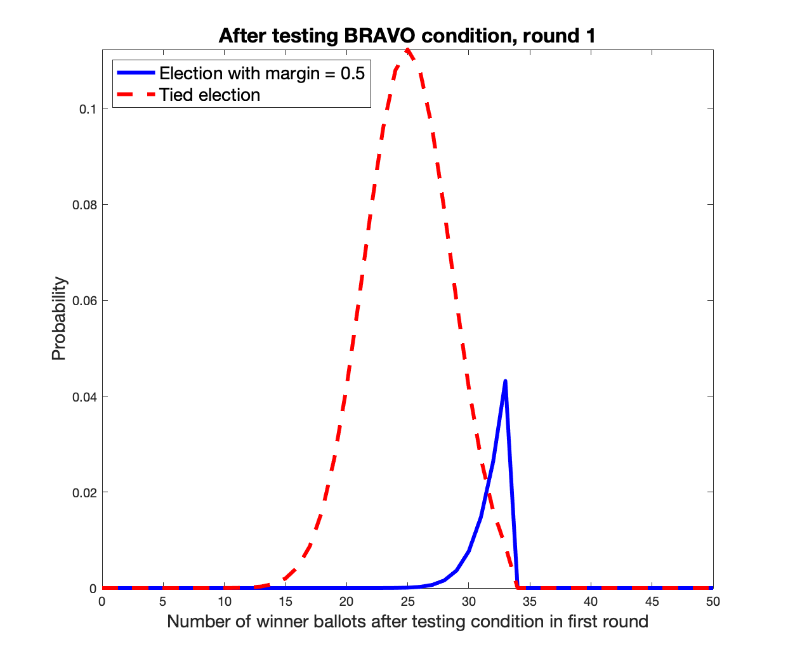
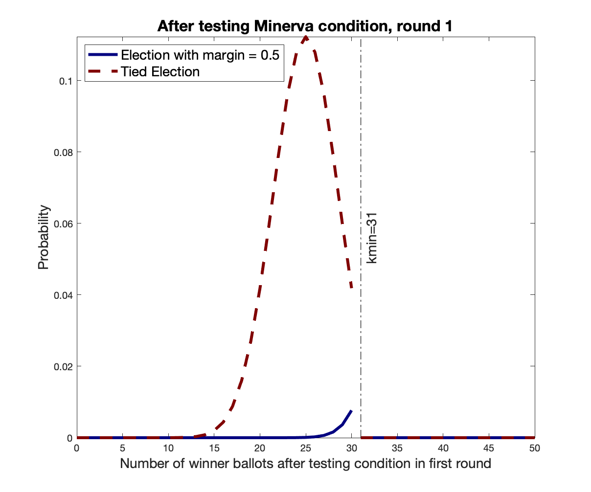

# *Athena*
exploratory code related to the *Athena* class of round-by-round RLAs

The code here assumes sampling with replacement. That is, we assume two candidates and no invalid votes. 

The folder Scripts contains: 
* Scripts for use in elections with multiple candidates and irrelevant (including invalid) votes. These scripts call the appropriate code for two candidates and no invalid votes, using the appropriate parameters. 

* Data for real elections, including the 2016 Presidential election by state, and the 2020 primaries for Montgomery County, Ohio

* Our first round estimates for the audits of the above elections. 

The folder Tables contains comparisons of first round sizes for Athena and R2 *BRAVO*, for some chosen states which we expect might perform ballot polling audits for the 2020 Presidential election. 

## The *Athena* Class of Audits

*BRAVO* and *Bayesian* audits are designed for use as B2 audits. Their stopping rules may be viewed as comparison tests of ratios of likelihoods or posterior probabilities respectively. 

The *Athena* class of audits, on the other hand, is designed for use as an R2 audit. It treats B2 audits as a special case of R2 audits, with round size = 1. The stopping rule for this class of audits is based on the tails of probability distributions. 

We can show that the *Athena* approach greatly improves efficiency. In fact, when compared to *R2 BRAVO*, *Athena* requires only about half the number of ballots for a 90\% stopping probability across a wide range of margins. *Athena* is also more efficient than the application of the *BRAVO* rule ballot-by-ballot when ballots are drawn in rounds. This implies that, when ballots are drawn in rounds, keeping track of the order of the samples is not useful for efficiency; it is better to use *Athena*. 

For simplicity here, we describe the Minerva audit first. 

## Minerva

Consider a two-contestant contest with no invalid votes. Let `x` be the announced fractional tally for the winner. 

Suppose the risk limit of the audit is 

Suppose `n1` ballots are drawn in the first round. Denote by `k1` the number of votes drawn for the winner. Suppose `n1=50` and `x=0.75` (corresponding to a margin of `0.5`). 

Figure 1 shows the probability distributions of `k1` given that the election is 

(a) as announced, with `x = 0.75` (blue solid curve), and 

(b) a tie (red dashed curve). 

Recall that the tied election is the wrong election outcome that is hardest to distinguish from the announced one, and hence defines the worst-case risk. (See [Risk-Limiting Bayesian Polling Audits for Two Candidate Elections](https://arxiv.org/abs/1902.00999)). 

Observe that, if `k1=32`, `Pr[k1=32 | margin=0.5] = 0.0264` and `Pr[k1=32 | margin=0] = 0.0160`. 
 

<b>Figure 1: Probability Distribution of Winner Votes for `x=0.75` and `n1=50`: First Round</b>

&NewLine;
&NewLine;
&NewLine;

The *BRAVO* p-value is defined as the ratio of the probabilities: 

 \alpha">

The *BRAVO* stopping rule is that the p-value is smaller than the risk limit, so we see that. the sample does not pass the *BRAVO* audit. 

The *Minerva* p-value is defined as the ratio of the tails, (red solid tail divided by blue semi-transparent tail)

Various members of the Athena class of audits have various stopping conditions.  We consider the simplest one, *Minerva*, where the above p-value is no larger than the risk limit, . Thus the sample passes the *Minerva* audit.  

The math for later rounds is somewhat more complicated, and we get to it soon. 

To view other plots similar to the above, you may try different values of `x`, `n1` and `k1` in this [script](https://github.com/gwexploratoryaudits/brla_explore/blob/poorvi/R2Audits/Athena/Scripts/Figures_For_Exposition/graph_athena_tails.m)

## Why do we claim that *Minerva* is risk-limiting? 

We have shown in [Risk-Limiting Bayesian Polling Audits for Two Candidate Elections](https://arxiv.org/abs/1902.00999) that the *BRAVO* p-value

decreases with an increase in `k1` (assuming `m > 0`, of course). Thus if we choose to stop for a particular value of `k1=32`, we should stop for larger values as well, because the p-value would be smaller. 

So if we decide to stop at `k1=32`: 

* The *stopping probability* (the probability that the audit will stop given that the election is as announced) should include the probabilities of all values of `k1 >= 32`. That is, the stopping probability is the tail of the solid blue curve, the translucent blue area: 

where  denotes the stopping probability for round *i*. 

* The *risk* (the probability that the audit will stop given that the election is tied) is the tail of the dashed red curve, the solid red area:

where  denotes the risk for round *i*.  

The *Minerva* stopping condition ensures that the risk is smaller than  times the stopping probability: 

If we can guarantee this for every round, that is, if our stopping condition ensures that: 

then: 

where  are the total risk and stopping probability respectively, and . 

That is, the total risk will be the sum of the risks of each individual round. Each of these risks is smaller than  times the corresponding stopping probability. Adding all the risks gives us the total risk, which is smaller than  times the total stopping probability. Because the total stopping probability cannot be larger than one, the total risk cannot be larger than . 

## Finding *kmin* for *BRAVO* and *Minerva*

### *BRAVO*
Because `k1=32` does not satisfy the *BRAVO* stopping condition, lower values of `k1` won't either. To find the smallest value of `k1` (`k1min`) satisfying the *BRAVO* condition, you could run https://github.com/gwexploratoryaudits/brla_explore/blob/poorvi/B2Audits/B2BRAVOkmin.m thus:

`[kmslope, kmintercept, n, kmin] = B2BRAVOkmin(0.5, 0.1);`

and find `kmin(j)` for `j` such that `n(j)=50`: 

`kmin(n==50)` which is `34`.  Using the following matlab commands you can check that the *BRAVO* p-value is at most , and that the p-value for `k1=33` is not:

`binopdf(34,50,0.5)/binopdf(34,50,0.75)`

to obtain `0.0675` which is smaller than .  And: 

`binopdf(33,50,0.5)/binopdf(33,50,0.75)`

to obtain `0.2025` which is larger than .  

### *Minerva*
Because `k1=32` does satisfy the *Minerva* stopping condition, lower values of `k1` might too. To find the smallest value of `k1` (`k1min`) satisfying the *Minerva* condition, you could run https://github.com/gwexploratoryaudits/brla_explore/blob/poorvi/R2Audits/Athena/AthenaNextkmin.m thus:

`[n_out, kmin, StopSched, RiskSched, CurrentTierStop, CurrentTierRisk] = Athenakmin(0.5, 0.1, 1.0, (50), 'Minerva');`

to obtain `kmin=31`. And you can check that the ratio of the tails: 

`(1-binocdf(30,50,0.5))/(1-binocdf(30,50,0.75))` is `0.0603` and no larger than .

And similarly that 

`(1-binocdf(29,50,0.5))/(1-binocdf(29,50,0.75))` is `0.1020` and larger than .

Note that `binocdf(30,50,0.5)` is `Pr[k1 <=30 | margin =0]` and hence that `1-binocdf(30,50,0.5)` is `Pr[k1 >= 31] | margin=0]` and so on. 

## Moving to the next round

We saw that `kmin=31` for *Minerva* and `kmin=34` for *BRAVO*. 

Recall that we would like to ensure that the risk is no more than  times the stopping probability for each subsequent round of the *Minerva* audit. Which means we should be sure to compute the distributions correctly. 

Suppose we draw `50` more ballots to get `n2=100` ballots in all. This does not mean, however, that the probability distribution on the winner ballots is the binomial distribution for `100` draws. In particular, because the audit stops for `k1>=kmin` winner ballots in the first round, we know that the probability of having `kmin+50` winner ballots in the second round is zero. Thus, if the audit continues, the probability distributions before the new sample is drawn are as shown in Figures 2 and 3.  

<figure>

<figcaption>Figure 2: Probability Distribution of Winner Votes for `x=0.75` and `n1=50`: After testing BRAVO stopping condition of first round</figcaption>
</figure>

<figure>

<figcaption>Figure 3: Probability Distribution of Winner Votes for `x=0.75` and `n1=50`: After testing Minerva stopping condition of first round</figcaption>
</figure>

You may generate similar images for different values of the risk limit, `n1` and `x` using the [script for *BRAVO*](https://github.com/gwexploratoryaudits/brla_explore/blob/poorvi/R2Audits/Athena/Scripts/Figures_For_Exposition/graph_bravo_lopped.m) and the [script for *Minerva*](https://github.com/gwexploratoryaudits/brla_explore/blob/poorvi/R2Audits/Athena/Scripts/Figures_For_Exposition/graph_minerva_lopped.m). 

To compute the probabilities after drawing the next lot of `50` ballots, we use the convolution function to compute the probability of the [sum of two random variables](https://en.wikipedia.org/wiki/Convolution_of_probability_distributions). 

One could have `k2` winner ballots after the second draw if one had `i` ballots for the winner after the stopping condition was tested in round 1 and one drew `k2-i` in round 2, for `i` lying between `0` and `kmin-1` and `k2-i` lying between `0` and `50`. 

if `f(k1)` is the distribution shown in Figure 2 or 3, the new distribution `g(k2)` after drawing `50` more ballots is: 

for the election as announced and similarly for the tied election. 

The convolution can be computed efficiently using Fourier Transforms, this result is the [convolution theorem](https://en.wikipedia.org/wiki/Convolution_theorem). 

Thus, after drawing the second sample, the probability distributions for *BRAVO* and *Minerva* are as in Figures 4 and 5. 

See also https://github.com/nealmcb/brla
