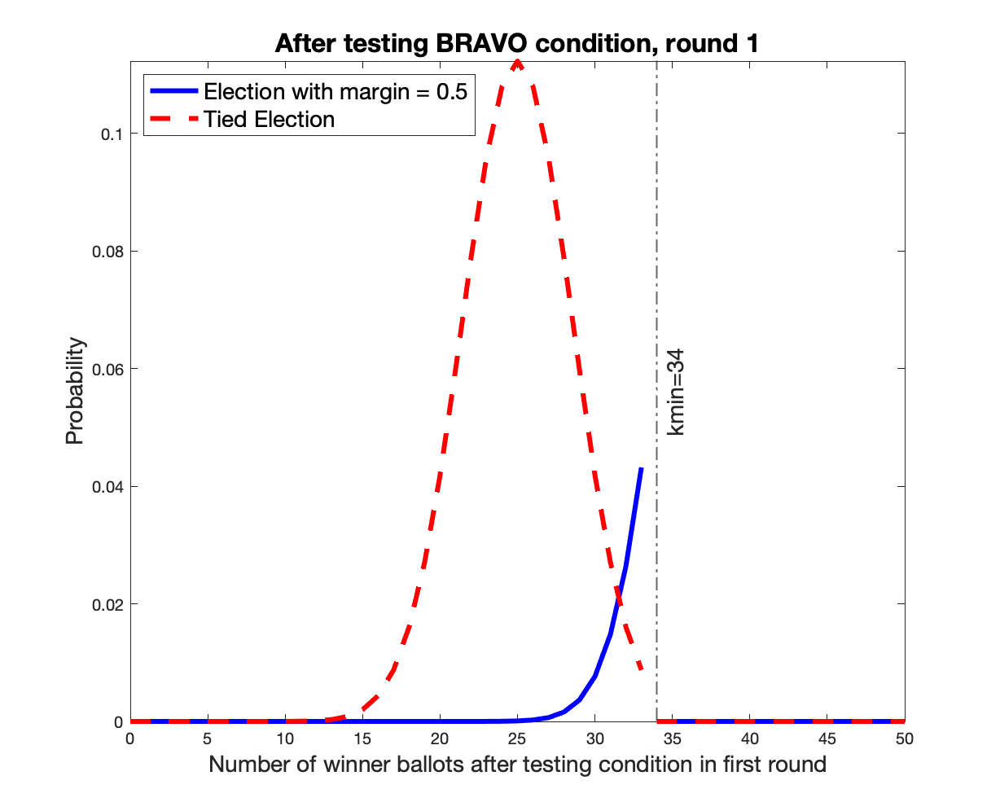
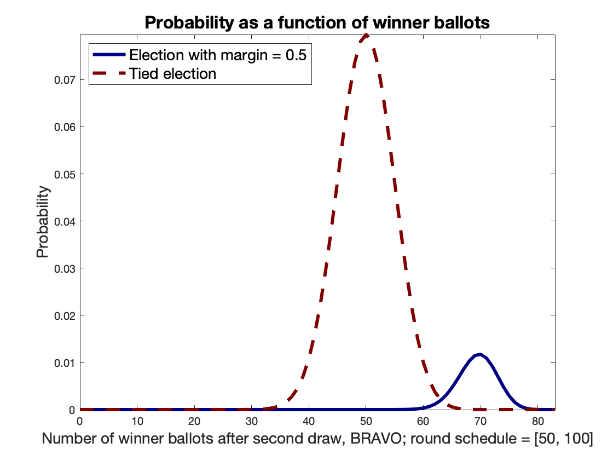
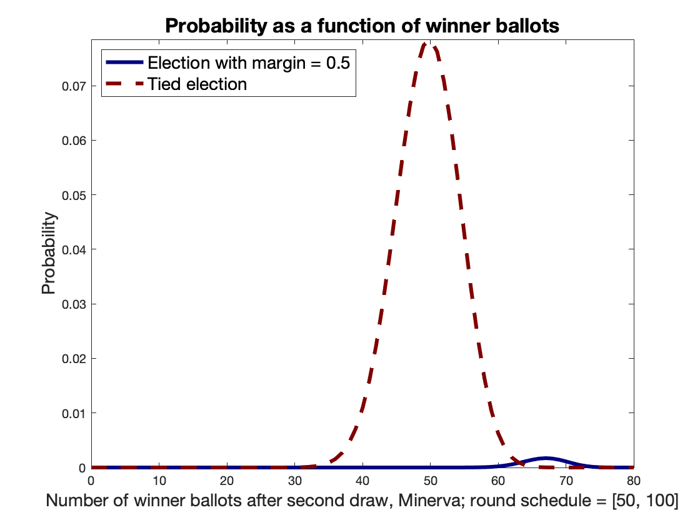

# *Athena*
exploratory code related to the *Athena* class of round-by-round RLAs

The code here assumes sampling with replacement. That is, we assume two candidates and no invalid votes. For a full description of the Athena class of audits and proofs of claimed properties, see the [*Athena*](https://arxiv.org/abs/2008.02315) paper. When we refer to *BRAVO* here, we mean EoR (end-of-round) BRAVO, where the stopping condition is tested at the end of the round. SB (selection-ordered) BRAVO is better studied using the code in B2audits. The Athena paper considers both approaches, but this README only addresses EoR BRAVO. 

The folder Scripts contains: 
* Scripts for use in elections with multiple candidates and irrelevant (including invalid) votes. These scripts call the appropriate code for two candidates and no invalid votes, using the appropriate parameters. 

* Data for real elections, including the 2016 Presidential election by state, and the 2020 primaries for Montgomery County, Ohio

* Our first round estimates for the audits of the above elections. 

* Scripts to generate the figures in this file

* Matlab figure files. 

The folder Presentations contains a presentation made at the EVN monthly conference and tables presenting comparisons of first round sizes for Athena and R2 *BRAVO*, for some chosen states which we expect might perform ballot polling audits for the 2020 Presidential election. "R2 *BRAVO*" (*round-by-round BRAVO*) refers to the application of the *BRAVO* rule after drawing a round of ballots, also known as EoR (end-of-round) BRAVO in the Athena paper. Numbers might differ slightly because the EVN presentation has number of distinct ballots drawn while the tables are older and have number of random draws. 

The folder fig contains the figures used here. 

BELOW WE PRESENT GRAPHS, AND, FOR PURPOSES OF EXPOSITION, MAKE AVAILABLE THE SCRIPTS WE USED TO GENERATE THE GRAPHS. THE SCRIPTS ARE NOT INTENDED TO BE ROBUST AND NO ERROR CHECKING IS PERFORMED; IT IS EXPECTED THAT THEY WILL BREAK IF YOU USE UNUSUAL PARAMETERS. THE SCRIPTS WERE WRITTEN ONLY FOR THE PURPOSE OF GENERATING THE GRAPHS. WHILE THEY CALL FUNCTIONS USED IN THE AUDITS, THE SCRIPTS THEMSELVES ARE NOT PART OF THE AUDIT CODE. 

## The *Athena* Class of Audits

*BRAVO* and *Bayesian* audits are designed for use as B2 audits: audits in which the decisions are taken after each ballot draw, *ballot-by-ballot*. Their stopping rules may be viewed as comparison tests of likelihood ratios or posterior probability ratios respectively. 

The *Athena* class of audits, on the other hand, is designed for use as an R2 audit: an audit in which decisions are taken after drawing a round of ballots, *round-by-round*. It treats B2 audits as a special case of R2 audits, with round size = 1. The stopping rule for this class of audits is based on the tails of probability distributions: more formally known as the complementary cumulative distribution functions (ccdfs). 

We can show that the *Athena* approach greatly improves efficiency. In fact, when compared to *R2 BRAVO*, *Athena* requires only about half the number of ballots for a single round with 90\% stopping probability across a wide range of margins. *Athena* is also more efficient than the application of the *BRAVO* rule ballot-by-ballot to a list of ordered ballots draws when ballots are drawn in rounds. This is because the use of *BRAVO* ignores available information from downlist ballot draws. This information was obtained at a cost of ballots, and could be used to make a better estimate of whether to stop. Thus, when ballots are drawn in rounds, keeping track of the order of the samples is not useful for efficiency; it is better to use an audit from the *Athena* class. 

For simplicity here, we describe the *Minerva* audit first. 

## *Minerva*

Consider a two-contestant contest with no invalid votes. Let `x` be the announced fractional tally for the winner. 

Suppose the risk limit of the audit is 

Suppose `n1` ballots are drawn in the first round. Denote by `k1` the number of votes drawn for the winner. Suppose `n1=50` and `x=0.75` (corresponding to a margin of `0.5`). 

Figure 1 shows the probability distributions of `k1` given that the election is 

(a) as announced, with `x = 0.75` (blue solid curve), and 

(b) a tie (red dashed curve). 

Recall that the tied election is the wrong election outcome that is hardest to distinguish from the announced one, and hence defines the worst-case risk. (See [Risk-Limiting Bayesian Polling Audits for Two Candidate Elections](https://arxiv.org/abs/1902.00999)). 

Observe that, if `k1=32`, `Pr[k1=32 | margin=0.5] = 0.0264` and `Pr[k1=32 | margin=0] = 0.0160`. 
 

Figure 1: Probability Distribution of Winner Votes for `x=0.75` and `n1=50`: First Round

 
 
 
 

The *BRAVO* p-value is defined as the ratio of the probabilities: 

 \alpha">

The *BRAVO* stopping rule requires that the p-value be no larger than the risk limit. We see that the sample does not pass the *BRAVO* audit. 

The *Minerva* p-value is defined as the ratio of the tails, (red solid tail divided by blue semi-transparent tail)

The *Minerva* stopping condition is that the above p-value be no larger than the risk limit, . Thus the sample passes the *Minerva* audit.  

The math for later rounds is somewhat more complicated, and we get to it soon. 

You may generate similar plots by trying different values of `x`, `n1` and `k1` in this [script](https://github.com/gwexploratoryaudits/brla_explore/blob/master/R2Audits/Athena/Scripts/Figures_For_Exposition/code/graph_athena_tails.m).

## Why do we claim that *Minerva* is risk-limiting? 

We have shown in [Risk-Limiting Bayesian Polling Audits for Two Candidate Elections](https://arxiv.org/abs/1902.00999) that the *BRAVO* p-value

decreases with an increase in `k1` (assuming `m > 0`, of course, where `m` is the election margin assumed for the alternate hypothesis). Thus if we choose to stop for a particular value of winner ballots in the sample, `k1=32` in this case, we should stop for larger values as well, because the p-values would all be smaller. 

If we decide to stop at `k1=32`: 

* The *stopping probability* (the probability that the audit will stop given that the election is as announced/assumed) should include the probabilities of all values of `k1` such that `k1 >= 32`. That is, the stopping probability is the tail of the solid blue curve, the translucent blue area in Figure 1: 

where  denotes the stopping probability for round *i*, and is equal to the sum of the probabilities of each sequence that satisfies the stopping condition in the *ith* round and no earlier. 

* Similarly, the *risk* (the probability that the audit will stop given that the election is tied) is the tail of the dashed red curve, the solid red area:

where  denotes the risk for round *i*.  

The *Minerva* stopping condition ensures that the risk is smaller than  times the stopping probability: 

If we can guarantee this for every round, that is, if our stopping condition ensures that: 

then: 

where  are the total risk and stopping probability respectively, and . 

That is, the total risk will be the sum of the risks of each individual round. The stopping condition ensures that each of these risks is no larger than  times the corresponding stopping probability. Adding all the risks gives us the total risk, which is no larger than  times the total stopping probability. Because the total stopping probability cannot be larger than one, the total risk cannot be larger than . 

## Finding *kmin* for *BRAVO* and *Minerva*

### *BRAVO*
Because `k1=32` does not satisfy the *BRAVO* stopping condition, lower values of `k1` won't either. To find the smallest value of `k1` (`k1min`) satisfying the *BRAVO* condition, you could run https://github.com/gwexploratoryaudits/brla_explore/blob/master/B2Audits/B2BRAVOkmin.m thus:

`[kmslope, kmintercept, n, kmin] = B2BRAVOkmin(0.5, 0.1);`

which gives you the slope and the intercept of the straight line relating the sample size `n` to `kmin`, which are same-size vectors. `n(1)` is the smallest round size for which the audit has any possibility of stopping, `kmin(1)` is the corresponding minimum number of winner ballots required to stop. 

Find `kmin(j)` for `j` such that `n(j)=50`: 

`kmin(n==50)` 

which is `34`.  Using the following matlab commands you can check that the *BRAVO* p-value is at most , and that the p-value for `k1=33` is not:

`binopdf(34,50,0.5)/binopdf(34,50,0.75)`

to obtain `0.0675` which is smaller than .  And: 

`binopdf(33,50,0.5)/binopdf(33,50,0.75)`

to obtain `0.2025` which is larger than .  

### *Minerva*
Because `k1=32` does satisfy the *Minerva* stopping condition, lower values of `k1` might too. To find the smallest value of `k1` (`k1min`) satisfying the *Minerva* condition, you could run https://github.com/gwexploratoryaudits/brla_explore/blob/master/R2Audits/Athena/AthenaNextkmin.m thus:

`[n_out, kmin, StopSched, RiskSched, CurrentTierStop, CurrentTierRisk] = Athenakmin(0.5, 0.1, 1.0, (50), 'Minerva');`

to obtain `kmin=31`. 

And you can check that the ratio of the tails: 

`(1-binocdf(30,50,0.5))/(1-binocdf(30,50,0.75))` is `0.0603` and no larger than .

And similarly that 

`(1-binocdf(29,50,0.5))/(1-binocdf(29,50,0.75))` is `0.1020` and larger than .

Note that `binocdf(30,50,0.5)` is `Pr[k1 <=30 | margin =0]` and hence that `1-binocdf(30,50,0.5)` is `Pr[k1 >= 31] | margin=0]` and so on. 

## Moving to the next round

We saw that `kmin=31` for *Minerva* and `kmin=34` for *BRAVO*. For our value of `k1=32`, the *Minerva* audit would stop, but the *BRAVO* audit would proceed to the next round. 

In order to understand how *Minerva* works, consider another value for `k1`, say `k1*=30` which will satisfy neither the *Minerva* nor the *BRAVO* stopping conditions. Both audits will proceed to the next round. 

Recall that we would like to ensure that the risk is no more than  times the stopping probability for each subsequent round of the *Minerva* audit. Which means we should be sure to compute the next round probability distributions correctly. 

Suppose we draw `50` more ballots to get `n2=100` ballots in all. This does not mean, however, that the probability distribution on the winner ballots is the binomial distribution for `100` draws. In particular, because the audit stops for `k1>=kmin` winner ballots in the first round, and the largest number of winner ballots going into the second round is `kmin-1`, we know that the probability of having `kmin+50` winner ballots in the second round is zero, even if all ballots drawn in the second round are for the winner. If the audit continues, the probability distributions before the new sample is drawn are as shown in Figures 2 and 3.  

Figure 2: Probability Distribution of Winner Votes for `x=0.75` and `n1=50`: After testing BRAVO stopping condition of first round
 
 
 
 

Figure 3: Probability Distribution of Winner Votes for `x=0.75` and `n1=50`: After testing Minerva stopping condition of first round
 
 
 
 

Note that the "discarded" tails, in both cases, represent the probabilities that the audit stops. When this is conditional to the election outcome being correct, we refer to it as the stopping probability of the round (`S1`), large values are good. When it is conditional to a tie, it is the worst-case risk corresponding to the round (`R1`), large values are bad. Our stopping condition bounds the worst-case risk to be no larger than a fraction  of the stopping probability. 

You may generate similar images for different values of the risk limit, `n1` and `x` using the [script for *BRAVO*](https://github.com/gwexploratoryaudits/brla_explore/blob/master/R2Audits/Athena/Scripts/Figures_For_Exposition/code/graph_bravo_lopped.m) and the [script for *Minerva*](https://github.com/gwexploratoryaudits/brla_explore/blob/master/R2Audits/Athena/Scripts/Figures_For_Exposition/code/graph_minerva_lopped.m). 

## Computing the distribution for the second round decision

To compute the probabilities after drawing the next lot of `50` ballots, we use the convolution function to compute the probability of the [sum of two random variables](https://en.wikipedia.org/wiki/Convolution_of_probability_distributions). 

One could have `ktotal` winner ballots after the second draw if one had `i` ballots for the winner after the stopping condition was tested in round 1 and one drew `ktotal-i` in round 2, for `i` lying between `0` and `kmin-1` and `ktotal-i` lying between `0` and `50`. 

if `f(k1)` is the distribution shown in Figure 2 or 3, the new distribution `g(ktotal)` after drawing `50` more ballots is: 

for the election as announced and similarly for the tied election. 

The convolution can be computed efficiently using Fourier Transforms, this result is the [convolution theorem](https://en.wikipedia.org/wiki/Convolution_theorem). 

After drawing the second sample, the probability distributions for *BRAVO* and *Minerva* are as in Figures 4 and 5. 

Figure 4: Probability Distribution of Winner Votes After Second Draw, *BRAVO*, for `x=0.75` and `[n1, n2] = [50,50]`. 
 
 
 
 

Figure 5: Probability Distribution of Winner Votes After Second Draw, *Minerva*, for `x=0.75` and `[n1, n2]=[50, 50]`. 
 
 
 
 

You may generate similar images for different values of the risk limit, `n1`, `n2` and `x` using the [script for *BRAVO*](https://github.com/gwexploratoryaudits/brla_explore/blob/master/R2Audits/Athena/Scripts/Figures_For_Exposition/code/graph_bravo_convolved.m) and the [script for *Minerva*](https://github.com/gwexploratoryaudits/brla_explore/blob/master/R2Audits/Athena/Scripts/Figures_For_Exposition/code/graph_minerva_convolved.m). 

Notice that the probabilities for winner ballots with *Minerva* (Figure 5) are much smaller than those for *BRAVO* (Figure 4). This is because the *kmin* for Minerva was smaller and hence the number of winner ballots going into the second round is smaller. Recall that `kmin=31` for *Minerva* and `kmin=34` for *BRAVO*. Hence the winner ballots going into a *Minerva* Round 2 is `30` or fewer, while for *BRAVO* the number is `33` or fewer. 

### *Minerva* tails
Now we examine more closely the tails of the *Minerva* distribution, using an example of `k2=34`; that is, the entire sample has `100` ballots, of which `k1*+k2 = 64` are for the winner. 

Figure 6: Close-Up of Probability Distribution of Winner Votes After Second Draw, *Minerva*, for `x=0.75` and `[n1, n2]=[50, 50]`. 
 
 
 
 

You may generate similar images for different values of the risk limit, `n1`, `n2`, `k1`, `k2` and `x` using the [script for *Minerva*](https://github.com/gwexploratoryaudits/brla_explore/blob/poorvi/R2Audits/Athena/Scripts/Figures_For_Exposition/code/graph_minerva_convolved_tails.m). In this case we see that the sample passes the audit because 

### *BRAVO* tails
For the same example above, we look more closely at the *BRAVO* distribution (note that the scale of the two figures is very different): 

Figure 7: Close-Up of Probability Distribution of Winner Votes After Second Draw, *BRAVO*, for `x=0.75` and `[n1, n2]=[50, 50]`. 
 
 
 
 

You may generate similar images for different values of the risk limit, `n1`, `n2`, `k1`, `k2` and `x` using the [script for *BRAVO*](https://github.com/gwexploratoryaudits/brla_explore/blob/poorvi/R2Audits/Athena/Scripts/Figures_For_Exposition/code/graph_bravo_convolved_tails.m). In this case we see that the sample does not pass the audit because 

 \alpha*Prob(winner ballots = 64~and~second~round | margin = 0.5~and~BRAVO~audit~[50,50]) = 0.1 \times 0.0031">

The tails are not of consequence for the *BRAVO* decision, however their values indicate the stopping probability and incurred risk, were the audit to stop at this draw. 

### Sanity Check
As one may recall, the *BRAVO* decision is independent of history. That is, it is based simply on the likelihood ratio of the particular *sequence* drawn, assuming ballots were drawn from a binomial distribution. Yet, above, we use values from the distribution for Round 2, which depends on the `kmin` value used in Round 1 and is hence different for the *BRAVO* and *Minerva* audits.  

In fact, if one uses the long format in matlab, one may verify that the *BRAVO* p-value is independent of whether the curve of Figure 7 (*BRAVO* stopping rule for Round 1) or that of Figure 6 (*Minerva* stopping rule for Round 1) is used to compute it. Here's why. 

The *BRAVO* p-value is based on the likelihood ratio of the sequence drawn. 

Similarly, 

On the other hand, 

where *number* is the number of ways in which one can draw *64* ballots in the second round in a *BRAVO* audit with the particular first round. The value of *number* depends on the audit, but is independent of the true tally or the hypothesis, so it cancels out when we use the likelihood ratio for drawing *64* ballots instead of that for drawing a single sequence of *64* ballots. For this reason, the likelihood ratio (p-value) is independent of the audit. 

## The third round
One would proceed in this manner for as many rounds as necessary, cutting off the tails of the distributions, convolving them with the binomials for the new draws, computing p-values, comparing the p-value to the risk limit, and, if the p-value is too large, cutting off the tail to move onto the next round. 
 
## B2 *BRAVO* stopping conditions are identical to *Minerva* with round size 1
One may observe that the stopping condition (and hence, the `kmin`) for B2 *BRAVO* is a special case of *Minerva* (or, more accurately, that *Minerva* is a generalization of *BRAVO*) as follows. 

Consider the B2 *BRAVO* audit, where stopping decisions are made after each ballot draw. Suppose the stopping condition is satisfied for a sample of size `n` and a particular sequence of ballots of which `k` are for the winner.  Hence: 

Given any `i > 0`, the probability of having `k+i` winner ballots of `n` is zero in this audit because, if there were `k+i` winner ballots in the sample of size `n` there would need to be at least `k+i-1 \geq k` in the sample of size `n-1`, and the audit would have satisfied the stopping condition at `n-1` ballots because:  
 

Thus the "tail" for the B2 *BRAVO* distribution is of size one, and the B2 *BRAVO* stopping condition is identical to that for *Minerva*. Note that the p-value, however, is not necessarily identical when the stopping condition is not satisfied. 

## *Minerva* is at least as efficient as EoR *BRAVO*

Let  denote the likelihood of `k_i` ballots for the winner in a sample of size `n_i` for the null hypothesis (tied election) and   that for the alternate hypothesis (election with fractional winner tally `x`), each for the `ith` round.  The likelihoods depend on the size of the previous rounds and other parameters defining the audit that are not overtly specified above, but are understood. 

Suppose the drawn sample satisfies the EoR *BRAVO* stopping condition. That is, suppose

 

Note that when `k_i` increases for a fixed `n_i`, the denominator above increases and the numerator is unchanged. Hence

 

Hence  
and the sample satisfies the *Minerva* stopping condition. 

Hence *Minerva* requires the drawing of no more ballots than does EoR *BRAVO*. 

Additionally, because  is monotone decreasing with `k_i`, *Minerva* accepts some values of `k_i` that do not satisfy the *BRAVO* condition and *Minerva* audits stop for samples that *BRAVO* does not stop for. That is, *Minerva* accepts values of `k_i` where  \alpha"> or  \alpha L^i_a(k_i,n_i)">  as long as, for larger number of winner votes, the ratio drops sufficiently and . This is illustrated by the example of Figure 1 which satisfied the *Minerva* condition but not the *BRAVO* one. 

For the above reason, in general, *Minerva* is more efficient than EoR *BRAVO*. 

*BRAVO* requires that each sequence that terminates the audit is such that it contributes risk that is no more than a risk-limit fraction of the stopping probability. 

*Minerva* requires that the relationship between risk and stopping probability be enforced at the level of the round: the combined risk contributed by all sequences that terminate the audit should be no more than a risk-limit fraction of the combined stopping probability. 

## *Metis*
Consider the fact that discreteness will typically require that the risk contribution of the round be slightly smaller than the risk-limit fraction of the stopping probability. The round thus leaves some risk on the table; or underspends the risk budget. This underspent risk could be rolled over into the next round. We propose another audit, *Metis*, which enforces the relationship between risk and stopping probability on the entire risk and the entire stopping probability of the audit so far, across all rounds. 

The *Metis* stopping condition for round `i_0` is: 

*Metis* differs from *Minerva* only when the audit has more than a single round. For the second round, the *Metis* p-value is the ratio of the sum of the risk tails of all rounds to the sum of the stopping probability tails of all rounds, where the tails of all previous rounds are defined by the value of `kmin` for that round. 

Observe that a sample satisfying *Minerva* will satisfy *Metis*, using the same arguments we used to show that a sample satisfying *BRAVO* satisfies *Minerva*. Thus *Metis* is at least as efficient as *Minerva*, and hence *BRAVO*. Note, however, that ballot-by-ballot *Metis* (*Metis* with round size `1`) is not *BRAVO*, nor is it *Minerva*. 

## Computing Stopping Probabilities Without Resorting to Simulations

See the [*Athena*](https://arxiv.org/abs/2008.02315) paper.

## Experimental Verification: *Athena* is more efficient than EoR or SB *BRAVO* for a single round and 90\% stopping probability

[Comparison of Athena with EoR BRAVO](fig/EoR-Distinct_Ballots.pdf)

[Comparison of Athena with EoR BRAVO](fig/SB-Distinct_Ballots.pdf)

## B2 *Metis* is more efficient than the B2 *SPRT*

TBD

See also https://github.com/nealmcb/brla
